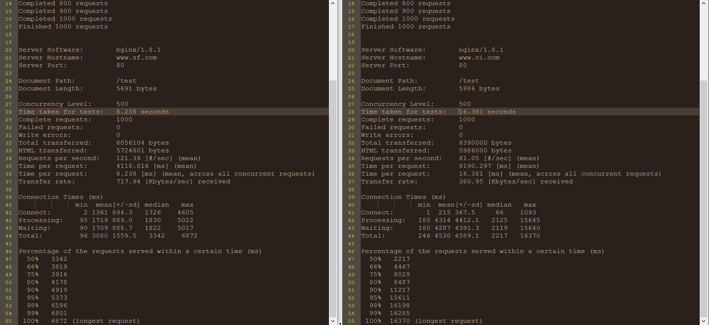

# SimpleFramework （[中文介绍](README_zh.md)）
SimpleFramework, lightweight yet powerful MVC framework.

## Features
* High performance: The performance is close to twice as Code Igniter.
* Lightweight: Core source code smaller than 100kb.
* Non-intrusive: More configuration takes more time to learn.
* Easy to expand.
* Clear orgnazition.
* Safe to filter all request.

## Benchmark
The performance is close to twice as Code Igniter (Compare to Code Igniter v3.0.5, same web page and query data), www.ci.com is sample of CI framework bind to local hosts.
```bash
ab -n 1000 -c 500 http://www.sf.com/test
ab -n 1000 -c 500 http://www.ci.com/test
```


## Deploy
simpleframework is source code, www.sf.com is sample code.
1. Create database for simpleframework and import data from simpleframework.sql under www.sf.com directory.
2. Add Nginx configuration:
```bash
server {
    listen       80;
    server_name www.sf.com; #YOUR DOMAIN
    root E:/dev-www/simpleframework/www.sf.com/www; #YOUR DIRECTORY
    location / {
    index  index.shtml index.htm index.php;
        if (!-e $request_filename){
            rewrite ^/(.*) /index.php last;
        }
    }

    location ~ \.php$ {
        fastcgi_pass   127.0.0.1:9000;
        fastcgi_index  index.php;
        fastcgi_param  SCRIPT_FILENAME  $document_root$fastcgi_script_name;
        include        fastcgi_params;
    }
}
```
3. Add hosts configuration, ("c:\Windows\System32\drivers\etc\hosts" on Windows):
```bash
127.0.0.1 www.sf.com
```
4. Update your database configuration: www.sf.com/application/config/development/config.php
5. Set www.sf.com/www/upload/  directory to writable.
6. Set www.sf.com/application/logs directory to writable.
7. Reload Nginx (Notice: upper/lower case on Linux)
8. Open your browser and visit  www.sf.com. Good luck :)

## Contact
Feel free to let me know if you have any problem. 273030282@qq.com

